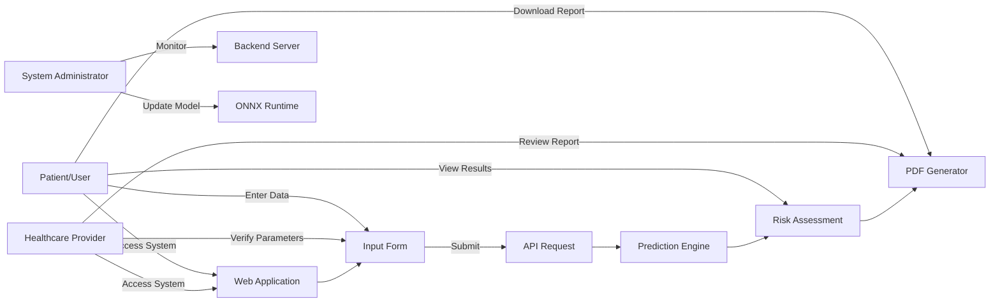
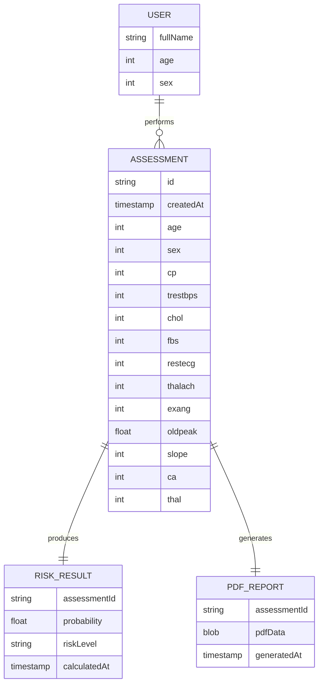
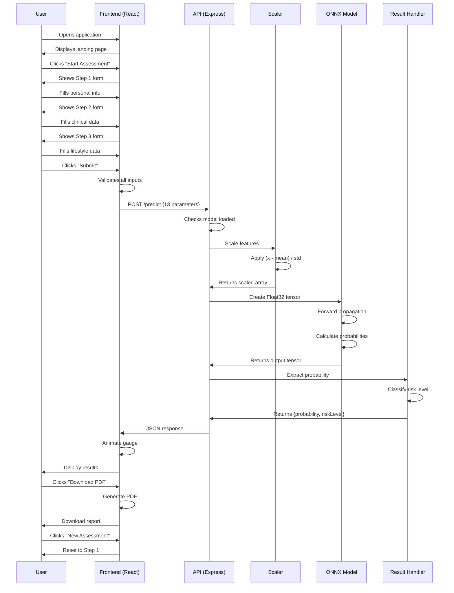

# CHAPTER 5: DESIGN AND ARCHITECTURE

## 5.1 Dataset Engineering

The CVD Risk Predictor system utilizes a machine learning model trained on the **Cleveland Heart Disease Dataset**, one of the most widely used datasets in cardiovascular disease research. This section describes the dataset characteristics, preprocessing steps, and feature engineering approach.

### 5.1.1 Dataset Overview

**Source**: UCI Machine Learning Repository - Heart Disease Dataset  
**Original Records**: 303 patients  
**Features**: 13 clinical parameters (after removing irrelevant attributes)  
**Target Variable**: Binary classification (presence/absence of heart disease)  
**Collection Period**: Cleveland Clinic Foundation dataset

### 5.1.2 Feature Description

| # | Feature | Description | Type | Range/Values |
|---|---------|-------------|------|--------------|
| 1 | **age** | Age in years | Continuous | 29-77 |
| 2 | **sex** | Gender | Categorical | 0=Female, 1=Male |
| 3 | **cp** | Chest pain type | Categorical | 0-3 (Typical/Atypical/Non-anginal/Asymptomatic) |
| 4 | **trestbps** | Resting blood pressure (mmHg) | Continuous | 94-200 |
| 5 | **chol** | Serum cholesterol (mg/dl) | Continuous | 126-564 |
| 6 | **fbs** | Fasting blood sugar > 120 mg/dl | Binary | 0=False, 1=True |
| 7 | **restecg** | Resting ECG results | Categorical | 0=Normal, 1=ST-T abnormality, 2=LVH |
| 8 | **thalach** | Maximum heart rate achieved | Continuous | 71-202 |
| 9 | **exang** | Exercise induced angina | Binary | 0=No, 1=Yes |
| 10 | **oldpeak** | ST depression induced by exercise | Continuous | 0-6.2 |
| 11 | **slope** | Slope of peak exercise ST segment | Categorical | 0=Upsloping, 1=Flat, 2=Downsloping |
| 12 | **ca** | Number of major vessels (0-3) | Discrete | 0-3 |
| 13 | **thal** | Thalassemia | Categorical | 0=Normal, 1=Fixed defect, 2=Reversible defect |

### 5.1.3 Data Preprocessing

**Feature Scaling**: StandardScaler normalization applied to ensure all features contribute equally to model predictions.

Formula: `scaled_value = (value - mean) / std_deviation`

Pre-computed scaling parameters:

```python
# Mean values for each feature
SCALER_MEAN = [
  54.54208754208754,   # age
  0.6767676767676768,  # sex
  3.1582491582491583,  # cp
  131.69360269360268,  # trestbps
  247.35016835016836,  # chol
  0.1447811447811448,  # fbs
  0.9966329966329966,  # restecg
  149.5993265993266,   # thalach
  0.3265993265993266,  # exang
  1.0555555555555556,  # oldpeak
  1.6026936026936027,  # slope
  0.6767676767676768,  # ca
  4.730639730639731    # thal
]

# Standard deviation values
SCALER_SCALE = [
  9.034487589926636,   # age
  0.4677105819309182,  # sex
  0.9632336979027394,  # cp
  17.73287743823472,   # trestbps
  51.909970707892114,  # chol
  0.35188004333438117, # fbs
  0.99323745892929,    # restecg
  22.90290733792757,   # thalach
  0.4689693022620916,  # exang
  1.1641579568929132,  # oldpeak
  0.6171451736665773,  # slope
  0.9373824451006205,  # ca
  1.9353622047234418   # thal
]
```

### 5.1.4 No External Dataset Dependency

Important: The production system does **NOT** store or access the training dataset. All predictions are performed using:
- Pre-trained neural network (model.onnx)
- Pre-computed scaling parameters (mean and standard deviation vectors)
- User-provided input at runtime

This approach ensures:
- Privacy (no patient data stored)
- Fast inference (no database queries)
- Scalability (stateless architecture)
- Security (minimal attack surface)

## 5.2 Use Case Diagram



### Use Case Descriptions:

**UC1: Perform Risk Assessment**
- **Actor**: Patient/User
- **Precondition**: User has access to clinical parameters
- **Main Flow**:
  1. User navigates to application
  2. Fills multi-step form with health data
  3. Submits for prediction
  4. Views animated risk score
  5. Downloads PDF report (optional)
- **Postcondition**: Risk assessment completed

**UC2: Review Patient Risk**
- **Actor**: Healthcare Provider
- **Precondition**: Patient has completed assessment
- **Main Flow**:
  1. Receives PDF report from patient
  2. Reviews risk score and parameters
  3. Makes clinical decisions based on results
- **Postcondition**: Patient care plan adjusted

**UC3: Update ML Model**
- **Actor**: System Administrator
- **Precondition**: New trained model available
- **Main Flow**:
  1. Converts new model to ONNX format
  2. Replaces model.onnx file on server
  3. Restarts backend service
  4. Verifies model loading
- **Postcondition**: System uses updated model

## 5.3 Entity Relationship Diagram



**Note**: In the actual implementation, data is NOT persisted in a database. This ER diagram represents the logical data relationships during a single request-response cycle. Data exists only in:
1. Browser memory (frontend state)
2. Request/response JSON (API communication)
3. Browser localStorage (optional, user-controlled)

## 5.4 Sequence Diagram



## 5.5 System Architecture Diagram

```
┌─────────────────────────────────────────────────────────────────┐
│                         USER INTERFACE                          │
│                     (Browser - Any Device)                      │
└────────────────────────────┬────────────────────────────────────┘
                             │ HTTPS
                             │
┌────────────────────────────▼────────────────────────────────────┐
│                    FRONTEND APPLICATION                         │
│                    (React + Vite + Tailwind)                    │
├─────────────────────────────────────────────────────────────────┤
│  ┌──────────────┐  ┌──────────────┐  ┌──────────────┐         │
│  │   Header     │  │  Input Form  │  │ Result Card  │         │
│  │   Component  │  │  (3 Steps)   │  │  + Gauge     │         │
│  └──────────────┘  └──────────────┘  └──────────────┘         │
│  ┌──────────────┐  ┌──────────────┐  ┌──────────────┐         │
│  │  Theme       │  │  About       │  │  PDF         │         │
│  │  Toggle      │  │  Modal       │  │  Generator   │         │
│  └──────────────┘  └──────────────┘  └──────────────┘         │
│                                                                 │
│  State Management: React Hooks (useState)                      │
│  API Client: Axios                                             │
│  Animations: Framer Motion                                     │
└────────────────────────────┬────────────────────────────────────┘
                             │ REST API
                             │ POST /predict
                             │ JSON Payload
┌────────────────────────────▼────────────────────────────────────┐
│                      BACKEND SERVER                             │
│                   (Node.js + Express.js)                        │
├─────────────────────────────────────────────────────────────────┤
│  ┌──────────────────────────────────────────────────────────┐  │
│  │                    MIDDLEWARE STACK                       │  │
│  │  • CORS Handler                                          │  │
│  │  • JSON Body Parser                                      │  │
│  │  • Morgan Logger                                         │  │
│  │  • Rate Limiter (200 req/min)                           │  │
│  └──────────────────────────────────────────────────────────┘  │
│                                                                 │
│  ┌──────────────────────────────────────────────────────────┐  │
│  │                   ROUTE HANDLERS                          │  │
│  │  GET  /        → Status check                            │  │
│  │  POST /predict → Prediction endpoint                     │  │
│  └──────────────────────────────────────────────────────────┘  │
│                                                                 │
│  ┌──────────────────────────────────────────────────────────┐  │
│  │               FEATURE PREPROCESSING                       │  │
│  │                                                           │  │
│  │  manualScale(inputData)                                  │  │
│  │  • Maps 13 features in correct order                     │  │
│  │  • Applies: (value - mean) / std                         │  │
│  │  • Returns Float32Array                                  │  │
│  └──────────────────────────────────────────────────────────┘  │
│                             │                                   │
│                             ↓                                   │
│  ┌──────────────────────────────────────────────────────────┐  │
│  │                  ONNX RUNTIME ENGINE                      │  │
│  │                                                           │  │
│  │  session = InferenceSession.create(model.onnx)           │  │
│  │  input = Tensor('float32', scaledData, [1, 13])          │  │
│  │  output = session.run({float_input: input})              │  │
│  │                                                           │  │
│  │  ┌─────────────────────────────────────────────┐         │  │
│  │  │       NEURAL NETWORK MODEL                  │         │  │
│  │  │       (Pre-trained, ONNX Format)            │         │  │
│  │  │                                             │         │  │
│  │  │  Input Layer (13 neurons)                  │         │  │
│  │  │       ↓                                     │         │  │
│  │  │  Hidden Layers (ReLU activation)           │         │  │
│  │  │       ↓                                     │         │  │
│  │  │  Output Layer (Sigmoid)                    │         │  │
│  │  │       ↓                                     │         │  │
│  │  │  Probability [0, 1]                        │         │  │
│  │  └─────────────────────────────────────────────┘         │  │
│  └──────────────────────────────────────────────────────────┘  │
│                             │                                   │
│                             ↓                                   │
│  ┌──────────────────────────────────────────────────────────┐  │
│  │                 RISK CLASSIFIER                           │  │
│  │                                                           │  │
│  │  if probability < 0.35  → "Low"                          │  │
│  │  if 0.35 ≤ probability < 0.65  → "Moderate"              │  │
│  │  if probability ≥ 0.65  → "High"                         │  │
│  └──────────────────────────────────────────────────────────┘  │
│                             │                                   │
│                             ↓                                   │
│  ┌──────────────────────────────────────────────────────────┐  │
│  │              RESPONSE FORMATTER                           │  │
│  │                                                           │  │
│  │  {                                                       │  │
│  │    "probability": 0.7234,                               │  │
│  │    "riskLevel": "High"                                  │  │
│  │  }                                                       │  │
│  └──────────────────────────────────────────────────────────┘  │
└────────────────────────────┬────────────────────────────────────┘
                             │ JSON Response
                             │
┌────────────────────────────▼────────────────────────────────────┐
│                      FRONTEND RENDERING                         │
│  • Receive response                                            │
│  • Animate gauge (0% → probability%)                           │
│  • Display risk level with color coding                        │
│  • Show personalized message                                   │
│  • Enable PDF download                                         │
└─────────────────────────────────────────────────────────────────┘
```

## 5.6 Component Interaction Diagram

```
┌─────────────────┐
│   App.jsx       │  Main application component
│   (Root)        │  • Manages global state
└────────┬────────┘  • Handles API communication
         │
         ├──────────────────────────────────────┐
         │                                      │
┌────────▼────────┐                    ┌───────▼────────┐
│  Header.jsx     │                    │ InputForm.jsx  │
│                 │                    │                │
│  • Logo         │                    │ • Step 1       │
│  • Dark Mode    │                    │ • Step 2       │
│  • About Modal  │                    │ • Step 3       │
└─────────────────┘                    │ • Validation   │
                                       │ • Presets      │
                                       └───────┬────────┘
                                               │
                         ┌─────────────────────┴────────────────┐
                         │                                      │
                ┌────────▼────────┐                   ┌─────────▼─────────┐
                │ Stepper.jsx     │                   │ API Call          │
                │                 │                   │ (axios.post)      │
                │ • Progress Bar  │                   │                   │
                │ • Step Labels   │                   │ → Backend Server  │
                └─────────────────┘                   └─────────┬─────────┘
                                                                │
                                                      ┌─────────▼─────────┐
                                                      │ Backend Response  │
                                                      │ {prob, riskLevel} │
                                                      └─────────┬─────────┘
                                                                │
                                                      ┌─────────▼─────────┐
                                                      │ ResultCard.jsx    │
                                                      │                   │
                                                      │ • User greeting   │
                                                      │ • Risk display    │
                                                      │ • Gauge           │
                                                      │ • PDF download    │
                                                      │ • Reset button    │
                                                      └─────────┬─────────┘
                                                                │
                                    ┌───────────────────────────┴─────────────┐
                                    │                                         │
                          ┌─────────▼──────────┐                  ┌──────────▼─────────┐
                          │ GaugeCircle.jsx    │                  │ generatePDF.js     │
                          │                    │                  │                    │
                          │ • SVG animation    │                  │ • jsPDF library    │
                          │ • Color coding     │                  │ • Report template  │
                          │ • Framer Motion    │                  │ • Auto-download    │
                          └────────────────────┘                  └────────────────────┘
```

## 5.7 Data Flow Diagram

```
Level 0: Context Diagram

┌──────────┐                           ┌──────────────────┐                    ┌──────────────┐
│          │  Clinical Parameters      │                  │  Risk Assessment   │              │
│   User   │ ────────────────────────> │  CVD Predictor   │ ────────────────> │ PDF Report   │
│          │                           │     System       │                    │              │
└──────────┘                           └──────────────────┘                    └──────────────┘


Level 1: Main Processes

┌────────────────┐
│  1.0           │
│  Input         │
│  Collection    │
│                │
│ • Validate     │
│ • Format       │
└───────┬────────┘
        │
        ↓
┌────────────────┐
│  2.0           │
│  Feature       │
│  Processing    │
│                │
│ • Scale        │
│ • Transform    │
└───────┬────────┘
        │
        ↓
┌────────────────┐
│  3.0           │
│  ML Inference  │
│                │
│ • ONNX Model   │
│ • Prediction   │
└───────┬────────┘
        │
        ↓
┌────────────────┐
│  4.0           │
│  Risk          │
│  Classification│
│                │
│ • Threshold    │
│ • Categorize   │
└───────┬────────┘
        │
        ↓
┌────────────────┐
│  5.0           │
│  Result        │
│  Presentation  │
│                │
│ • Display      │
│ • Generate PDF │
└────────────────┘
```

## 5.8 Class Diagram (React Components)

```
┌─────────────────────────────┐
│         App                 │
├─────────────────────────────┤
│ - isLoading: boolean        │
│ - result: object | null     │
│ - error: string | null      │
├─────────────────────────────┤
│ + submit(payload): void     │
│ + reset(): void             │
└──────────┬──────────────────┘
           │ contains
           ├──────────────────────────┐
           │                          │
┌──────────▼──────────┐    ┌──────────▼──────────┐
│     Header          │    │    InputForm        │
├─────────────────────┤    ├─────────────────────┤
│ - darkMode: boolean │    │ - step: number      │
│ - showAbout: bool   │    │ - form: object      │
├─────────────────────┤    │ - error: string     │
│ + toggleTheme()     │    ├─────────────────────┤
│ + openAbout()       │    │ + onChange()        │
└─────────────────────┘    │ + validate()        │
                           │ + nextStep()        │
                           │ + prevStep()        │
                           │ + fillPreset()      │
                           │ + submit()          │
                           └──────────┬──────────┘
                                      │ uses
                           ┌──────────▼──────────┐
                           │     Stepper         │
                           ├─────────────────────┤
                           │ - currentStep: int  │
                           │ - totalSteps: int   │
                           ├─────────────────────┤
                           │ + render()          │
                           └─────────────────────┘

┌─────────────────────────────┐
│      ResultCard             │
├─────────────────────────────┤
│ - result: object            │
│ - onReset: function         │
├─────────────────────────────┤
│ + render()                  │
└──────────┬──────────────────┘
           │ contains
           ├──────────────────────────┐
           │                          │
┌──────────▼──────────┐    ┌──────────▼──────────┐
│   GaugeCircle       │    │  generatePDF        │
├─────────────────────┤    ├─────────────────────┤
│ - probability: float│    │ - patientData: obj  │
│ - size: number      │    ├─────────────────────┤
├─────────────────────┤    │ + generate()        │
│ + getColor()        │    │ + download()        │
│ + render()          │    └─────────────────────┘
└─────────────────────┘
```

---

*This chapter provides detailed design specifications including dataset engineering, UML diagrams, system architecture, component interactions, and data flow. The next chapter will cover system requirements analysis and specifications.*
