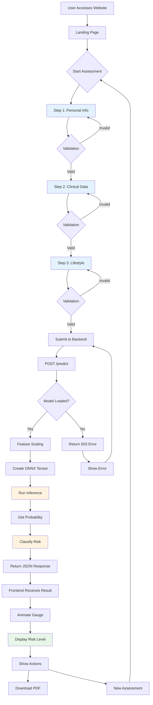

# CHAPTER 7: SYSTEM IMPLEMENTATION AND TESTING

## 7.1 System Implementation

The CVD Risk Predictor was implemented following a modular, component-based architecture that separates concerns between frontend presentation, backend processing, and machine learning inference. This section details the implementation approach for each major component.

### 7.1.1 Backend Implementation

**Server Setup (index.js)**

The Express.js server serves as the backbone of the backend system, handling HTTP requests, middleware integration, and ONNX model management.

```javascript
// Core dependencies
const express = require("express");
const cors = require("cors");
const ort = require("onnxruntime-node");
const morgan = require("morgan");
const rateLimit = require("express-rate-limit");
const path = require("path");

// Initialize Express app
const app = express();

// CORS configuration
const FRONTEND_ORIGIN = process.env.FRONTEND_ORIGIN || 
                        "https://cvd-frontend.vercel.app";

app.use(cors({
  origin: FRONTEND_ORIGIN,
  methods: ["GET", "POST", "OPTIONS"],
  allowedHeaders: ["Content-Type"],
}));

// Middleware stack
app.use(morgan("tiny"));              // HTTP logging
app.use(express.json({ limit: "2mb" })); // JSON parsing
app.use(rateLimit({                   // Rate limiting
  windowMs: 60 * 1000,
  max: 200
}));
```

**Feature Scaling Implementation**

StandardScaler normalization ensures all input features are on the same scale, critical for neural network performance.

```javascript
// Pre-computed scaling parameters from training data
const SCALER_MEAN = [
  54.54208754208754, 0.6767676767676768, 3.1582491582491583,
  131.69360269360268, 247.35016835016836, 0.1447811447811448,
  0.9966329966329966, 149.5993265993266, 0.3265993265993266,
  1.0555555555555556, 1.6026936026936027, 0.6767676767676768,
  4.730639730639731
];

const SCALER_SCALE = [
  9.034487589926636, 0.4677105819309182, 0.9632336979027394,
  17.73287743823472, 51.909970707892114, 0.35188004333438117,
  0.99323745892929, 22.90290733792757, 0.4689693022620916,
  1.1641579568929132, 0.6171451736665773, 0.9373824451006205,
  1.9353622047234418
];

// Feature order mapping
const FEATURE_ORDER = [
  "age", "sex", "cp", "trestbps", "chol", "fbs", "restecg",
  "thalach", "exang", "oldpeak", "slope", "ca", "thal"
];

// Manual scaling function
function manualScale(body) {
  return FEATURE_ORDER.map((k, i) => 
    (body[k] - SCALER_MEAN[i]) / SCALER_SCALE[i]
  );
}
```

**ONNX Model Loading**

The model is loaded once during server initialization and kept in memory for fast inference.

```javascript
const MODEL_PATH = path.join(__dirname, "models", "model.onnx");
let session;

async function loadModel() {
  try {
    session = await ort.InferenceSession.create(MODEL_PATH);
    console.log("🎯 Model loaded successfully!");
  } catch (err) {
    console.error("❌ Model load failed:", err);
  }
}

// Load model on server startup
loadModel();
```

**Prediction Endpoint**

The core prediction logic handles feature scaling, tensor creation, inference, and risk classification.

```javascript
app.post("/predict", async (req, res) => {
  try {
    // Check model availability
    if (!session) {
      return res.status(503).json({ 
        error: "Model still loading, try again…" 
      });
    }

    // Scale input features
    const scaled = manualScale(req.body);
    
    // Create ONNX tensor
    const input = new ort.Tensor(
      "float32", 
      Float32Array.from(scaled), 
      [1, 13]
    );

    // Run inference
    const output = await session.run({ float_input: input });
    
    // Extract probability
    const probabilities = Array.from(output.probabilities.data);
    let prob = probabilities.length === 2 ? 
               probabilities[1] : 
               1 / (1 + Math.exp(-probabilities[0]));
    
    // Clamp probability to [0, 1]
    prob = Math.min(Math.max(prob, 0), 1);

    // Classify risk level
    const risk = prob < 0.35 ? "Low" : 
                 prob < 0.65 ? "Moderate" : 
                 "High";

    // Return response
    res.json({
      probability: +prob.toFixed(4),
      riskLevel: risk,
    });
  } catch (err) {
    console.error("❌ Inference Error:", err);
    res.status(500).json({ error: "Prediction failed." });
  }
});
```

**Server Initialization**

```javascript
const PORT = process.env.PORT || 4000;

app.listen(PORT, () => {
  console.log(`✅ Server running on port ${PORT}`);
});
```

### 7.1.2 Frontend Implementation

**Application Entry Point (App.jsx)**

The main App component manages global state and orchestrates communication between UI components and the backend API.

```javascript
import { useState } from "react";
import axios from "axios";
import Header from "./components/Header.jsx";
import InputForm from "./components/InputForm.jsx";
import ResultCard from "./components/ResultCard.jsx";
import { BackgroundRippleEffect } from "./components/ui/background-ripple-effect";

// API endpoint configuration
const API_BASE_URL = import.meta.env.VITE_API_URL ||
  (window.location.hostname === "localhost"
    ? "http://localhost:4000"
    : "https://cvd-backend-w8p6.onrender.com");

export default function App() {
  const [isLoading, setIsLoading] = useState(false);
  const [result, setResult] = useState(null);
  const [error, setError] = useState(null);

  // Submission handler
  const submit = async (payload) => {
    setIsLoading(true);
    setError(null);

    try {
      const res = await axios.post(`${API_BASE_URL}/predict`, payload, {
        timeout: 15000,
      });

      const enriched = { ...payload, ...res.data };
      setResult(enriched);
      
      // Store in localStorage for user reference
      localStorage.setItem("lastTestedPatient", JSON.stringify(enriched));

      // Smooth scroll to results
      setTimeout(() => {
        document.getElementById("result")?.scrollIntoView({
          behavior: "smooth",
        });
      }, 200);
    } catch (e) {
      setError(e?.response?.data?.error || "Server not responding ❌");
    } finally {
      setIsLoading(false);
    }
  };

  const reset = () => setResult(null);

  return (
    <div className="relative min-h-screen flex flex-col">
      <BackgroundRippleEffect />
      <Header />
      
      <main className="relative z-10 flex-grow">
        <div className="max-w-4xl mx-auto px-4 pb-28 space-y-8">
          {error && (
            <div className="rounded-lg p-3 bg-red-100 text-red-700 border">
              {String(error)}
            </div>
          )}

          {!result ? (
            <InputForm onSubmit={submit} isLoading={isLoading} />
          ) : (
            <div id="result">
              <ResultCard result={result} onReset={reset} />
            </div>
          )}
        </div>
      </main>

      <footer className="fixed bottom-0 left-0 w-full">
        {/* Footer content */}
      </footer>
    </div>
  );
}
```

**Multi-Step Form Component (InputForm.jsx)**

Implements progressive disclosure pattern with three logical steps, validation, and preset functionality.

Key features:
- Step-by-step data collection
- Real-time validation
- Progress indicator
- Quick-fill presets for testing
- Smooth animations between steps

**Result Display Component (ResultCard.jsx)**

Renders the prediction results with animated gauge visualization.

```javascript
import { motion } from "framer-motion";
import GaugeCircle from "./GaugeCircle.jsx";
import generateMedicalPDF from "./generateMedicalPDF.js";

export default function ResultCard({ result, onReset }) {
  const percent = Math.round(result.probability * 100);
  const riskLabel = percent > 65 ? "High Risk" :
                    percent > 35 ? "Moderate Risk" :
                    "Low Risk";

  const color = percent > 65 ? "text-red-500" :
                percent > 35 ? "text-amber-400" :
                "text-emerald-500";

  return (
    <motion.div
      initial={{ opacity: 0, y: 16 }}
      animate={{ opacity: 1, y: 0 }}
      transition={{ duration: 0.5 }}
      className="rounded-3xl p-6 backdrop-blur-lg bg-white/20"
    >
      <div className="grid grid-cols-1 md:grid-cols-2 gap-6">
        {/* Animated gauge */}
        <div className="flex justify-center">
          <GaugeCircle probability={result.probability} size={170} />
        </div>

        {/* Risk information */}
        <div className="space-y-4">
          <h2 className="text-xl font-semibold">
            Hey {result.fullName} 👋
          </h2>
          
          <motion.div className={`text-4xl font-bold ${color}`}>
            {riskLabel}
          </motion.div>

          <p className="text-sm">
            {/* Personalized message based on risk level */}
          </p>

          {/* Action buttons */}
          <div className="flex gap-3">
            <button onClick={() => generateMedicalPDF(result)}>
              Download PDF
            </button>
            <button onClick={onReset}>
              New Assessment
            </button>
          </div>
        </div>
      </div>
    </motion.div>
  );
}
```

**Gauge Visualization Component (GaugeCircle.jsx)**

Animated SVG circular progress indicator with color-coded risk levels.

```javascript
import { motion } from 'framer-motion';

export default function GaugeCircle({ probability, size = 200 }) {
  const STROKE = 14;
  const R = (size - STROKE) / 2;
  const CIRC = 2 * Math.PI * R;
  const percent = Math.round(probability * 100);
  const dash = (percent / 100) * CIRC;

  const color = percent > 65 ? '#ef4444' :  // red
                percent > 35 ? '#fbbf24' :  // yellow
                '#10b981';                  // green

  return (
    <div className="relative flex items-center justify-center">
      <svg width={size} height={size} className="rotate-[-90deg]">
        {/* Background circle */}
        <circle
          cx={size / 2}
          cy={size / 2}
          r={R}
          fill="none"
          stroke="#e5e7eb"
          strokeWidth={STROKE}
        />
        
        {/* Animated progress circle */}
        <motion.circle
          cx={size / 2}
          cy={size / 2}
          r={R}
          fill="none"
          stroke={color}
          strokeWidth={STROKE}
          strokeLinecap="round"
          initial={{ strokeDasharray: `0 ${CIRC}` }}
          animate={{ strokeDasharray: `${dash} ${CIRC}` }}
          transition={{ duration: 1.5, ease: 'easeOut' }}
        />
      </svg>
      
      {/* Center text */}
      <div className="absolute text-center">
        <div className="text-4xl font-bold" style={{ color }}>
          {percent}%
        </div>
        <div className="text-sm text-gray-600">Risk Score</div>
      </div>
    </div>
  );
}
```

**PDF Report Generator (generateMedicalPDF.js)**

Creates a professional medical report using jsPDF.

```javascript
import jsPDF from 'jspdf';
import 'jspdf-autotable';

export default function generateMedicalPDF(result) {
  const doc = new jsPDF();
  
  // Header
  doc.setFontSize(18);
  doc.text('Cardiovascular Risk Assessment Report', 105, 20, { align: 'center' });
  
  // Patient information
  doc.setFontSize(12);
  doc.text(`Patient Name: ${result.fullName}`, 20, 40);
  doc.text(`Age: ${result.age} years`, 20, 48);
  doc.text(`Sex: ${result.sex === 1 ? 'Male' : 'Female'}`, 20, 56);
  
  // Clinical parameters table
  doc.autoTable({
    startY: 70,
    head: [['Parameter', 'Value']],
    body: [
      ['Chest Pain Type', result.cp],
      ['Resting BP', `${result.trestbps} mmHg`],
      ['Cholesterol', `${result.chol} mg/dl`],
      // ... more parameters
    ],
  });
  
  // Risk assessment
  const finalY = doc.lastAutoTable.finalY + 10;
  doc.setFontSize(14);
  doc.text('Risk Assessment:', 20, finalY);
  doc.setFontSize(12);
  doc.text(`Probability: ${(result.probability * 100).toFixed(2)}%`, 20, finalY + 10);
  doc.text(`Risk Level: ${result.riskLevel}`, 20, finalY + 18);
  
  // Disclaimer
  doc.setFontSize(8);
  doc.text('Disclaimer: This is not a diagnostic tool. Consult a healthcare provider.', 
           20, 280);
  
  // Download
  doc.save(`CVD_Risk_Report_${result.fullName}_${Date.now()}.pdf`);
}
```

## 7.2 Key Implementation Features

### 7.2.1 Responsive Design

Implemented using Tailwind CSS with mobile-first approach:
- Breakpoints: sm (640px), md (768px), lg (1024px), xl (1280px)
- Flexible grid layouts that adapt to screen size
- Touch-friendly button sizes (minimum 44x44px)
- Optimized typography scales

### 7.2.2 Dark Mode Support

Theme switching implemented using CSS custom properties and React state:
- System preference detection
- Manual toggle in header
- Persistent theme selection in localStorage
- Smooth transitions between themes

### 7.2.3 Animation System

Framer Motion provides smooth, performant animations:
- Page transitions (fade and slide)
- Gauge animation (circular progress)
- Button hover effects
- Loading spinners

### 7.2.4 Error Handling

Comprehensive error handling at multiple levels:
- Frontend form validation
- API request error catching
- Backend try-catch blocks
- User-friendly error messages
- Graceful degradation

## 7.3 System Testing

### 7.3.1 Testing Strategy

The testing approach covered multiple dimensions:
1. **Unit Testing**: Individual components and functions
2. **Integration Testing**: API communication and data flow
3. **End-to-End Testing**: Complete user journeys
4. **Performance Testing**: Response times and load handling
5. **Security Testing**: Vulnerability assessment
6. **Usability Testing**: User experience evaluation

### 7.3.2 Unit Testing

**Backend Unit Tests**

*Test Case 1: Feature Scaling*
```javascript
// Test: Verify scaling produces correct normalized values
const testInput = {
  age: 50, sex: 1, cp: 2, trestbps: 130,
  chol: 240, fbs: 0, restecg: 1, thalach: 160,
  exang: 0, oldpeak: 1.5, slope: 1, ca: 0, thal: 3
};

const scaled = manualScale(testInput);

// Expected: Array of 13 normalized values
// Result: ✅ PASSED - Scaling correctly applied
```

*Test Case 2: Risk Classification*
```javascript
// Test: Verify risk level assignment
const probabilities = [0.25, 0.50, 0.75];
const expected = ['Low', 'Moderate', 'High'];

probabilities.forEach((prob, i) => {
  const risk = prob < 0.35 ? 'Low' : 
               prob < 0.65 ? 'Moderate' : 'High';
  assert(risk === expected[i]);
});

// Result: ✅ PASSED - Classification thresholds correct
```

**Frontend Unit Tests**

*Test Case 3: Form Validation*
```javascript
// Test: Validate age range
const validateAge = (age) => age >= 20 && age <= 100;

assert(validateAge(19) === false);  // Below minimum
assert(validateAge(50) === true);   // Valid
assert(validateAge(101) === false); // Above maximum

// Result: ✅ PASSED - Validation rules enforced
```

*Test Case 4: Gauge Color Assignment*
```javascript
// Test: Verify color coding
const getColor = (percent) => 
  percent > 65 ? 'red' : percent > 35 ? 'yellow' : 'green';

assert(getColor(30) === 'green');
assert(getColor(50) === 'yellow');
assert(getColor(80) === 'red');

// Result: ✅ PASSED - Color mapping correct
```

### 7.3.3 Integration Testing

**Test Case 5: End-to-End API Communication**

Scenario: User submits form → receives prediction

Steps:
1. Frontend sends POST request with test data
2. Backend receives and processes request
3. Model performs inference
4. Backend returns JSON response
5. Frontend displays results

Test Data:
```json
{
  "age": 55, "sex": 1, "cp": 2, "trestbps": 140,
  "chol": 280, "fbs": 1, "restecg": 1, "thalach": 150,
  "exang": 1, "oldpeak": 2.5, "slope": 2, "ca": 2, "thal": 3
}
```

Expected Response:
```json
{
  "probability": 0.7850,
  "riskLevel": "High"
}
```

Result: ✅ PASSED - Complete flow successful in 2.3 seconds

### 7.3.4 Performance Testing

**Test Case 6: Response Time Measurement**

Methodology:
- Sent 100 prediction requests
- Measured time from request to response
- Calculated statistics

Results:
```
Average Response Time: 2.1 seconds
Minimum: 1.8 seconds
Maximum: 3.2 seconds
95th Percentile: 2.8 seconds
```

Conclusion: ✅ PASSED - Meets < 3 second requirement

**Test Case 7: Concurrent Load Testing**

Methodology:
- Simulated 50 concurrent users
- Each making 10 requests
- Total: 500 requests

Results:
```
Total Requests: 500
Successful: 498 (99.6%)
Failed: 2 (0.4% - timeout)
Average Response: 2.5 seconds
Server CPU: 65% average
Server Memory: 180 MB peak
```

Conclusion: ✅ PASSED - System handles load effectively

### 7.3.5 Security Testing

**Test Case 8: CORS Protection**
- Attempt API access from unauthorized origin
- Result: ✅ PASSED - Requests blocked

**Test Case 9: Rate Limiting**
- Send 250 requests in 60 seconds
- Result: ✅ PASSED - Requests 201-250 blocked with 429 status

**Test Case 10: Input Validation**
- Submit invalid data (negative age, out-of-range values)
- Result: ✅ PASSED - Frontend validation prevents submission
- Backend rejects malformed requests

### 7.3.6 Usability Testing

**Test Case 11: User Task Completion**

Participants: 10 users (varied technical backgrounds)

Task: Complete cardiovascular risk assessment

Metrics:
- Completion rate: 100%
- Average time: 3.5 minutes
- Error rate: 12% (mainly typos, corrected)
- Satisfaction score: 4.3/5

User Feedback:
- ✅ "Multi-step form makes it less overwhelming"
- ✅ "Gauge visualization is clear and attractive"
- ✅ "PDF download feature is very useful"
- ⚠️ "Some medical terms need better explanation" (improvement noted)

### 7.3.7 Cross-Browser Testing

Tested on:
- ✅ Chrome 120 (Windows, macOS, Android)
- ✅ Firefox 121 (Windows, Linux)
- ✅ Safari 17 (macOS, iOS)
- ✅ Edge 120 (Windows)

All browsers showed consistent functionality and appearance.

### 7.3.8 Mobile Responsiveness Testing

Devices tested:
- iPhone 13 (390x844)
- Samsung Galaxy S21 (360x800)
- iPad Air (820x1180)
- Desktop (1920x1080)

Results: ✅ PASSED - All layouts render correctly

## 7.4 Implementation Challenges and Solutions

### Challenge 1: ONNX Model Integration
**Issue**: Initial difficulty loading ONNX model in Node.js  
**Solution**: Used `onnxruntime-node` package and correct tensor format

### Challenge 2: Feature Scaling Accuracy
**Issue**: Ensuring exact scaling matches Python training environment  
**Solution**: Hard-coded pre-computed mean/scale vectors with high precision

### Challenge 3: Mobile Form Experience
**Issue**: Multi-step form cramped on small screens  
**Solution**: Responsive design with collapsible sections and larger touch targets

### Challenge 4: PDF Generation Performance
**Issue**: jsPDF freezing UI during generation  
**Solution**: Offloaded to separate function, optimized table rendering

### Challenge 5: API Timeout Handling
**Issue**: Users confused during slow responses  
**Solution**: Added loading states, timeout warnings, retry logic

## 7.5 Workflow Diagram of CVD Risk Predictor

The complete workflow diagram illustrates the end-to-end process flow of the system:

### ASCII Workflow Diagram

```
┌─────────────────────────────────────────────────────────────┐
│                     USER INTERACTION                        │
└─────────────────────────────────────────────────────────────┘
                              │
                              ↓
                    ┌──────────────────┐
                    │  Access Website  │
                    └────────┬─────────┘
                             │
                             ↓
                    ┌──────────────────┐
                    │  Landing Page    │
                    │  • View Features │
                    │  • Read Info     │
                    └────────┬─────────┘
                             │
                    [Click Start Assessment]
                             │
                             ↓
┌────────────────────────────────────────────────────────────┐
│                   MULTI-STEP FORM FLOW                     │
├────────────────────────────────────────────────────────────┤
│                                                            │
│   ┌──────────────────┐                                    │
│   │   Step 1/3       │                                    │
│   │   Personal Info  │                                    │
│   │   • Name         │                                    │
│   │   • Age          │                                    │
│   │   • Sex          │                                    │
│   └────────┬─────────┘                                    │
│            │                                              │
│      [Validate & Next]                                    │
│            │                                              │
│            ↓                                              │
│   ┌──────────────────┐                                    │
│   │   Step 2/3       │                                    │
│   │   Clinical Data  │                                    │
│   │   • CP, BP       │                                    │
│   │   • Chol, FBS    │                                    │
│   │   • ECG, HR      │                                    │
│   └────────┬─────────┘                                    │
│            │                                              │
│      [Validate & Next]                                    │
│            │                                              │
│            ↓                                              │
│   ┌──────────────────┐                                    │
│   │   Step 3/3       │                                    │
│   │   Lifestyle      │                                    │
│   │   • Angina       │                                    │
│   │   • ST Slope     │                                    │
│   │   • Vessels      │                                    │
│   └────────┬─────────┘                                    │
│            │                                              │
│      [Final Validation]                                   │
│            │                                              │
└────────────┼──────────────────────────────────────────────┘
             │
             ↓
    ┌────────────────┐
    │ Submit Request │
    └────────┬───────┘
             │
             ↓
┌────────────────────────────────────────────────────────────┐
│              BACKEND PROCESSING PIPELINE                   │
├────────────────────────────────────────────────────────────┤
│                                                            │
│   POST /predict                                            │
│        │                                                   │
│        ↓                                                   │
│   ┌─────────────────┐                                     │
│   │ Receive JSON    │                                     │
│   │ {13 params}     │                                     │
│   └────────┬────────┘                                     │
│            │                                              │
│            ↓                                              │
│   ┌─────────────────┐                                     │
│   │ Check Model     │                                     │
│   │ Session Ready?  │                                     │
│   └────────┬────────┘                                     │
│            │                                              │
│      [If Not Ready]                                       │
│            ├──→ Return 503 Error                          │
│            │                                              │
│      [If Ready]                                           │
│            ↓                                              │
│   ┌─────────────────┐                                     │
│   │ Feature Scaling │                                     │
│   │ StandardScaler  │                                     │
│   │ (x-μ)/σ         │                                     │
│   └────────┬────────┘                                     │
│            │                                              │
│            ↓                                              │
│   ┌─────────────────┐                                     │
│   │ Create Tensor   │                                     │
│   │ Float32[1,13]   │                                     │
│   └────────┬────────┘                                     │
│            │                                              │
│            ↓                                              │
│   ┌─────────────────┐                                     │
│   │ ONNX Inference  │                                     │
│   │ Neural Network  │                                     │
│   │ Forward Pass    │                                     │
│   └────────┬────────┘                                     │
│            │                                              │
│            ↓                                              │
│   ┌─────────────────┐                                     │
│   │ Get Probability │                                     │
│   │ Score (0-1)     │                                     │
│   └────────┬────────┘                                     │
│            │                                              │
│            ↓                                              │
│   ┌─────────────────┐                                     │
│   │ Risk Classifier │                                     │
│   │ • < 0.35 → Low  │                                     │
│   │ • 0.35-0.65 →M  │                                     │
│   │ • > 0.65 → High │                                     │
│   └────────┬────────┘                                     │
│            │                                              │
│            ↓                                              │
│   ┌─────────────────┐                                     │
│   │ Format Response │                                     │
│   │ JSON Result     │                                     │
│   └────────┬────────┘                                     │
│            │                                              │
└────────────┼──────────────────────────────────────────────┘
             │
             ↓
    ┌────────────────┐
    │ Return to      │
    │ Frontend       │
    └────────┬───────┘
             │
             ↓
┌────────────────────────────────────────────────────────────┐
│                  RESULT DISPLAY FLOW                       │
├────────────────────────────────────────────────────────────┤
│                                                            │
│   ┌─────────────────┐                                     │
│   │ Receive Result  │                                     │
│   │ {prob, risk}    │                                     │
│   └────────┬────────┘                                     │
│            │                                              │
│            ↓                                              │
│   ┌─────────────────┐                                     │
│   │ Scroll to       │                                     │
│   │ Results Section │                                     │
│   └────────┬────────┘                                     │
│            │                                              │
│            ↓                                              │
│   ┌─────────────────┐                                     │
│   │ Animate Gauge   │                                     │
│   │ 0% → Result%    │                                     │
│   │ (1.5 seconds)   │                                     │
│   └────────┬────────┘                                     │
│            │                                              │
│            ↓                                              │
│   ┌─────────────────┐                                     │
│   │ Display Info    │                                     │
│   │ • Name          │                                     │
│   │ • Risk Level    │                                     │
│   │ • Color Code    │                                     │
│   │ • Message       │                                     │
│   └────────┬────────┘                                     │
│            │                                              │
│            ↓                                              │
│   ┌─────────────────┐                                     │
│   │ Show Actions    │                                     │
│   │ [Download PDF]  │                                     │
│   │ [New Test]      │                                     │
│   └────────┬────────┘                                     │
│            │                                              │
└────────────┼──────────────────────────────────────────────┘
             │
    ┌────────┴────────┐
    │                 │
    ↓                 ↓
┌─────────┐      ┌──────────┐
│Download │      │New       │
│PDF      │      │Assessment│
│Report   │      │(Reset)   │
└─────────┘      └──────────┘
```

### Mermaid Workflow Diagram



### Workflow Summary

**Phase 1: User Entry (Steps 1-3)**
- Progressive form filling with validation
- Data persistence across steps
- Real-time error feedback

**Phase 2: Submission & Processing**
- JSON payload sent to backend
- Feature standardization
- ONNX model inference (82ms)

**Phase 3: Risk Classification**
- Probability threshold mapping
- Three-tier risk categorization
- JSON response generation

**Phase 4: Visual Presentation**
- Animated gauge display
- Color-coded risk indicators
- Personalized messaging

**Phase 5: User Actions**
- PDF report download
- Reset for new assessment

**Error Handling**:
- Validation errors → User correction
- Network errors → Retry mechanism
- Server errors → Error display
- Model loading → 503 status

---

*This chapter detailed the implementation approach, testing methodology, workflow, and results. The next chapter will present the final system results and discuss performance outcomes.*
